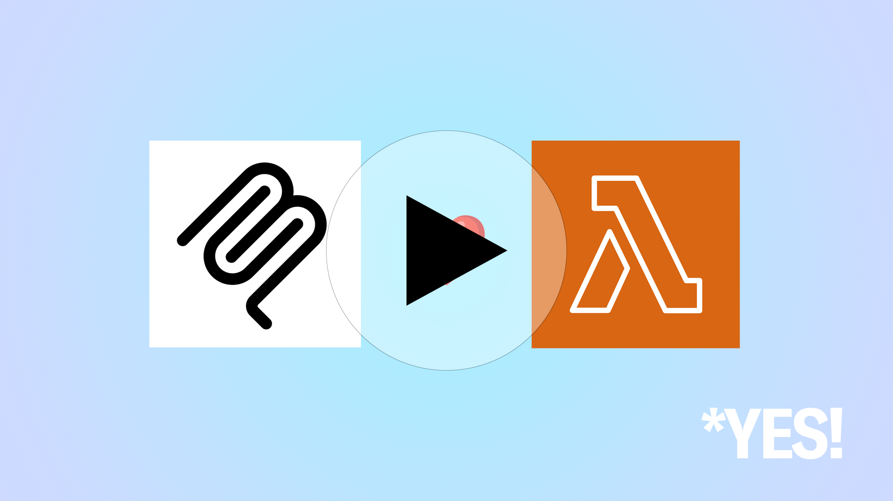

# Lambda MCP Server Demo (Streamable HTTP) 

> This server requires a client that supports Streamable HTTP (not SSE).  There are very few MCP clients that currently support Streamable HTTP (let me know if you have one), as such there is a Streamable HTTP client included in this repo, built with the [TypeScript MCP SDK which does support Streamable HTTP](https://github.com/modelcontextprotocol/typescript-sdk?tab=readme-ov-file#streamable-http).

This project demonstrates a powerful and developer-friendly way to create serverless [MCP (Model Context Protocol)](https://github.com/modelcontextprotocol) tools using [AWS Lambda](https://aws.amazon.com/lambda/?trk=64e03f01-b931-4384-846e-db0ba9fa89f5&sc_channel=code). It showcases how to build a stateless, serverless MCP server with minimal boilerplate and an excellent developer experience.

The included client demonstrates integration with [Amazon Bedrock](https://aws.amazon.com/bedrock/?trk=64e03f01-b931-4384-846e-db0ba9fa89f5&sc_channel=code), using the Bedrock Converse API and [Amazon Nova Pro](https://docs.aws.amazon.com/nova/latest/userguide/what-is-nova.html?trk=64e03f01-b931-4384-846e-db0ba9fa89f5&sc_channel=code) to build an intelligent agent.

## the_context()

In a recent episode of [the_context](https://www.youtube.com/playlist?list=PLeAh2CQypN9V8E-pkG6ZAXj-w3dgy1qQn), Tiffany Souterre and Mike discussed streamable HTTP for MCP as well as running this project:

<p align="center">
  <a href="https://youtu.be/Ejua5LQTqek">
    <br>
  </a>
</p>

## Example

After you import LambdaMCPServer, this is all the code you need:

```Python
from lambda_mcp.lambda_mcp import LambdaMCPServer

# Create the MCP server instance
mcp_server = LambdaMCPServer(name="mcp-lambda-server", version="1.0.0")

@mcp_server.tool()
def say_hello_world() -> int:
    """Say hello world!"""
    return "Hello MCP World!"

def lambda_handler(event, context):
    """AWS Lambda handler function."""
    return mcp_server.handle_request(event, context) 
```

That's it! :) 

## Session State Management

The Lambda MCP Server includes built-in session state management that persists across tool invocations within the same conversation. This is particularly useful for tools that need to maintain context or share data between calls.

Session data is stored in a DynamoDB table against a sessionId key. This is all managed for you.

Here's an example of how to use session state:

```Python
from lambda_mcp.lambda_mcp import LambdaMCPServer

session_table = os.environ.get('MCP_SESSION_TABLE', 'mcp_sessions')

mcp_server = LambdaMCPServer(name="mcp-lambda-server", version="1.0.0", session_table=session_table)

@mcp_server.tool()
def increment_counter() -> int:
    """Increment a session-based counter."""
    # Get the current counter value from session state, default to 0 if not set
    counter = mcp_server.session.get('counter', 0)
    
    # Increment the counter
    counter += 1
    
    # Store the new value in session state
    mcp_server.session['counter'] = counter
    
    return counter

@mcp_server.tool()
def get_counter() -> int:
    """Get the current counter value."""
    return mcp_server.session.get('counter', 0)
```

The session state is automatically managed per conversation and persists across multiple tool invocations. This allows you to maintain stateful information without needing additional external storage, while still keeping your Lambda function stateless.

## Authentication

The sample server stack uses Bearer token authentication via an Authorization header, which is compliant with the MCP standard. This provides a basic level of security for your MCP server endpoints. Here's what you need to know:

1. **Bearer Token**: When you deploy the stack, a bearer token is configured through a custom authorizer in API Gateway
2. **Using the Bearer Token**: 
   - The client must include the bearer token in requests using the `Authorization` header with the format: `Bearer <your-token>`
   - The token value is provided in the stack outputs after deployment
   - The sample client is configured to automatically include this header when provided with the token

3. **Custom Authorizer**: The implementation uses a simple custom authorizer that validates a single bearer token. This can be easily extended or replaced with more sophisticated authentication systems like Amazon Cognito for production use.

⚠️ **Security Note**: The `run-client.sh` script will store the provided bearer token in a file called `.mcp-api-token` as well as the provided URL in `.mcp-config`. While this is a convenience, this is not a production ready implementation.

⚠️ **Security Note**: While bearer token authentication provides a standard-compliant authentication mechanism, consider implementing additional security measures such as:
- AWS IAM roles and policies
- OAuth 2.0 / JWT with proper token management
- Amazon Cognito User Pools

The current bearer token implementation is primarily intended for demonstration and development purposes. For production systems handling sensitive data, implement appropriate additional security measures based on your specific requirements.

## What is this all about?

This is a proof-of-concept implementation of an MCP server running on AWS Lambda, along with a TypeScript client that demonstrates its functionality. The project consists of two main components:

1. **Lambda MCP Server**: A Python-based serverless implementation that makes it incredibly simple to deploy cloud hosted MCP tools.
2. **TypeScript HTTP Client**: A demonstration client that shows how to interact with the Lambda MCP server using Amazon Bedrock's Converse API _(At the time of writing the TypeScript MCP SDK was one of the only if not THE only SDK to support HTTP)_.

## Example Tools

The server comes with three example tools that demonstrate different use cases:

1. `get_time()`: Returns the current UTC time in ISO format
1. `get_weather(city: str)`: Simulates weather data for a given city
1. `count_s3_buckets()`: Counts [AWS S3](https://aws.amazon.com/s3/?trk=64e03f01-b931-4384-846e-db0ba9fa89f5&sc_channel=code) buckets in your account

## Getting Started

### Prerequisites

- [AWS Account](https://aws.amazon.com/free/?trk=64e03f01-b931-4384-846e-db0ba9fa89f5&sc_channel=code) with appropriate permissions
- [AWS SAM CLI](https://docs.aws.amazon.com/serverless-application-model/latest/developerguide/install-sam-cli.html?trk=64e03f01-b931-4384-846e-db0ba9fa89f5&sc_channel=code) installed
- [Node.js and npm](https://nodejs.org/) (for the client)
- [Docker](https://docs.docker.com/get-docker/) (for the client)
- [Python 3.9+](https://www.python.org/downloads/)
- Access to [Amazon Bedrock](https://docs.aws.amazon.com/bedrock/latest/userguide/what-is-bedrock.html?trk=64e03f01-b931-4384-846e-db0ba9fa89f5&sc_channel=code) in your AWS account
- [Amazon Nova Pro](https://docs.aws.amazon.com/nova/latest/userguide/what-is-nova.html?trk=64e03f01-b931-4384-846e-db0ba9fa89f5&sc_channel=code) enabled in your Amazon Bedrock model access settings

### Amazon Bedrock Setup

Before running the client, ensure you have:

1. [Enabled Amazon Bedrock access](https://docs.aws.amazon.com/bedrock/latest/userguide/setting-up.html?trk=64e03f01-b931-4384-846e-db0ba9fa89f5&sc_channel=code) in your AWS account
2. [Enabled the Amazon Nova Models](https://docs.aws.amazon.com/bedrock/latest/userguide/model-access.html?trk=64e03f01-b931-4384-846e-db0ba9fa89f5&sc_channel=code) in your Bedrock model access settings
3. Appropriate [IAM permissions](https://docs.aws.amazon.com/bedrock/latest/userguide/security-iam.html?trk=64e03f01-b931-4384-846e-db0ba9fa89f5&sc_channel=code) to invoke Bedrock APIs

### Server Deployment

1. Clone this repository:
   ```bash
   git clone <repository-url>
   ```

1. Navigate to the server directory:
   ```bash
   cd server-http-python-lambda
   ```

1. Deploy using SAM:
   ```bash
   sam build
   sam deploy --guided
   ```

   Note: You will be prompted for an `McpAuthToken`.  This is the Authorization Bearer token that will be requitred to call the endpoint. This simple implimentation uses an [AWS API Gateway authorizers](https://docs.aws.amazon.com/apigateway/latest/developerguide/apigateway-use-lambda-authorizer.html?trk=64e03f01-b931-4384-846e-db0ba9fa89f5&sc_channel=code) with the `McpAuthToken` passed in as an env var.  This can be swapped out for a production implimentation as required. 

### Client Setup

1. Navigate to the client directory:
   ```bash
   cd client-http-typescript-docker
   ```

1. Run the helper script:
   ```bash
   run-client.sh
   ```

## Adding New Tools

The Lambda MCP Server is designed to make tool creation as simple as possible. Here's how to add a new tool:

1. Open `server/app.py`
2. Add your new tool using the decorator pattern:

```python
@mcp_server.tool()
def my_new_tool(param1: str, param2: int) -> str:
    """Your tool description.
    
    Args:
        param1: Description of param1
        param2: Description of param2
        
    Returns:
        Description of return value
    """
    # Your tool implementation
    return f"Processed {param1} with value {param2}"
```

That's it! The decorator handles:
- Type validation
- Request parsing
- Response formatting
- Error handling
- MCP Documentation generation

## Notes

- At the time of writing the [TypeScript MCP SDK](https://github.com/modelcontextprotocol/typescript-sdk?tab=readme-ov-file#streamable-http) is one of the few (if only) implementations that support HTTP-based MCP communication.
- For production use, consider adding authentication and authorization using [AWS IAM best practices](https://docs.aws.amazon.com/IAM/latest/UserGuide/best-practices.html?trk=64e03f01-b931-4384-846e-db0ba9fa89f5&sc_channel=code)

## Security

See [CONTRIBUTING](CONTRIBUTING.md#security-issue-notifications) for more information.

For AWS security best practices, refer to the [AWS Security Documentation](https://docs.aws.amazon.com/security/?trk=64e03f01-b931-4384-846e-db0ba9fa89f5&sc_channel=code) and [Amazon Bedrock security best practices](https://docs.aws.amazon.com/bedrock/latest/userguide/security.html?trk=64e03f01-b931-4384-846e-db0ba9fa89f5&sc_channel=code).

## License

This library is licensed under the [MIT-0 License](https://github.com/aws/mit-0). See the LICENSE file.

## Changes

### Version 1.1.0
- Replaced API Key authentication with Bearer token authentication via Authorization header
- Added custom authorizer to API Gateway for token validation
- Updated client configuration to use bearer tokens
- Made authentication system compliant with MCP standard
- Added this change log section

### Version 1.0.0
- Initial release
- Basic MCP server implementation with AWS Lambda
- Session state management with DynamoDB
- Example tools implementation
- TypeScript HTTP client with Amazon Bedrock integration
